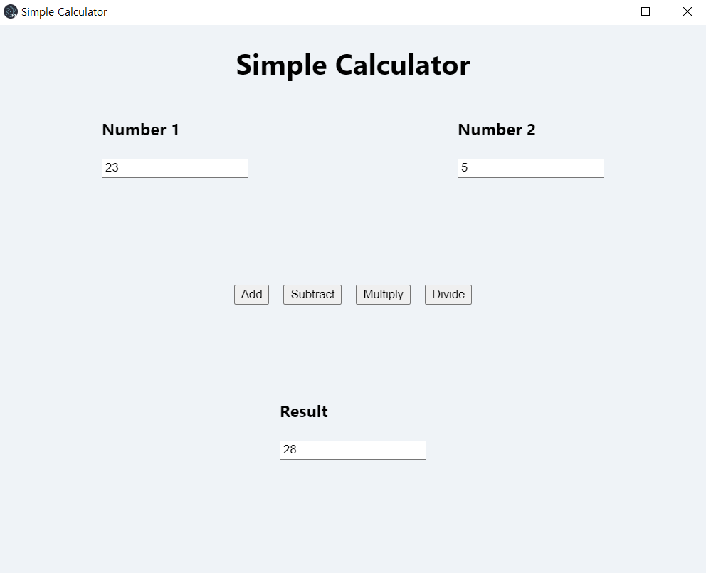

# electron-zmq-py-toy

## What is this?
This is a toy project, in which you use electron for GUI, and python for business logic. It uses zeromq for communication.

## What value this project creates

Generally, you don't have to do this for no reason. If you are a javascript programmer, it would be better to do this all with the only javascript. If you are a Python programmer, there is PyQt/PySide for GUI parts. However, there are some cases you need this as follows.

- You prefer Electron for GUI. But there is already an existing python module or project. You don't want to spend time creating existing the wheel.

- You prefer Electron for GUI. But, Python has more powerful libraries in the scientific area like `numpy`, `pandas`, `scikit-learn`, and, etc. So, if you want to do a scientific thing, Python might be a good option.

- You are a Python programmer, but you want to use web technologies (HTML/CSS/Javascript) or web frameworks (React.js, Vue.js, and, etc.). Generally, web technologies have more online/offline materials to refer to and are easy to learn.

- If you consider responsiveness important, web technologies are better than PyQt (just my opinion.), But, Electron consumes quite larger memory than PyQt, so, you should have it in mind if you are a python programmer.

## How this works

It's not about using python in electron codebase, which is impossible. It's more about communication between javascript and python. You use `zeromq ` for communication.

*Zeromq is a zero-cost messaging queue library. It's faster than HTTP communication, and considered a good option for InterProcessComuunication.*

When you execute an electron application, it executes a Python server and connects to it. Now, you can send a message in JSON format to that server. Python server handles that message and responds to that request. (Yes, it uses zmq `REQ-REP` pattern)

That's it. It's so simple. For more detail, you can explore the codebase. The client directory is for Electron, and the server directory is for the python server.

## How to reproduce or test this project

I tested this in Windows OS. If you want to test this on another platform, you are required to modify it to make it work

1. Install all dependencies
    - Install javascript dependencies

    ```
    cd client && yarn install # (or npm install)
    ```

    - Install python dependencies (I recommend using virtualenv)

    ```
    cd ../server && pip install -r requirements.txt && pip install -r requirements.dev.txt
    ```

2. Build application

    ```
    # following command builds both Python and Electron apps
    cd ../client && yarn build
    ```

3. Start application

    The above command creates the `dist` directory. Go to dist/win-unpacked and start `ElectronZMQPyToy.exe`.

    


## You can do more

This is a just simple toy project. You can do develop it. Here are some suggestions.

- You can add a PUB-SUB pattern to publish streaming/event data to the client.

- You can use React/Vue for your client.

- You can use another format for communication such as MessagePack ([msgpack-python](https://github.com/msgpack/msgpack-python) / [msgpack-javascript](https://github.com/msgpack/msgpack-javascript)) for better performance.

## License

[MIT](./LICENSE)

Copyright (c) 2020-present, SJQuant